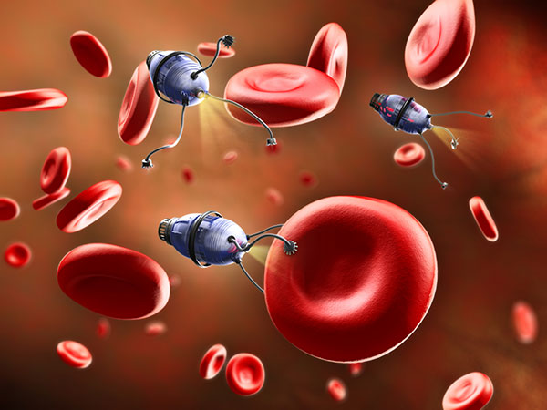
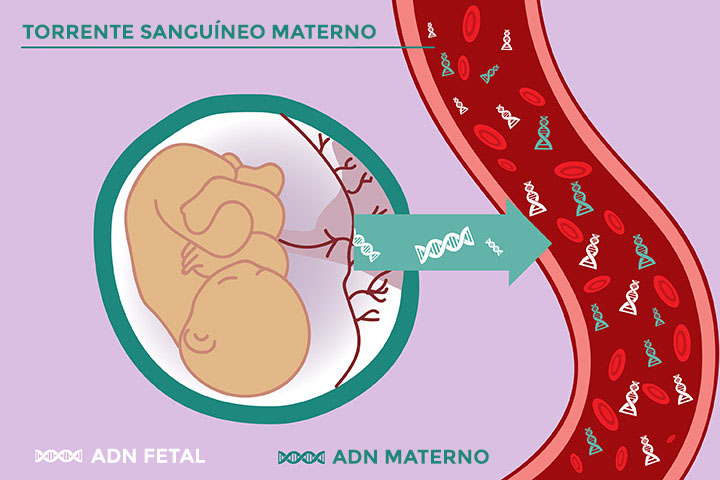
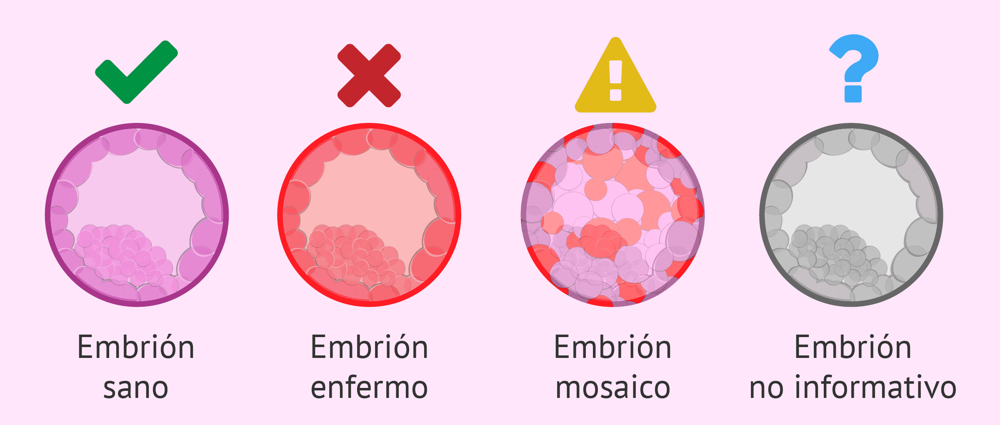
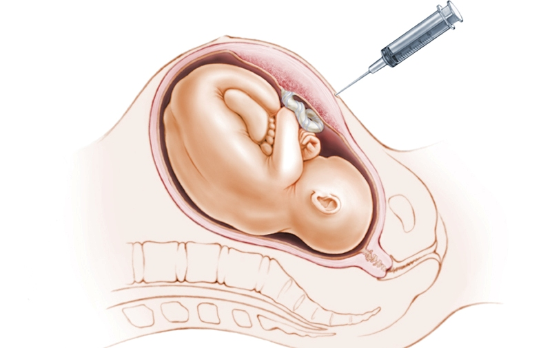

# Aplicaciones de la Biotecnologia en Obstetricia.
El campo de la Obstetricia ha experimentado una revolución gracias a los avances de la Biotecnología Roja (aplicaciones en salud humana). Estas herramientas moleculares y genéticas han pasado de ser meros instrumentos de investigación a convertirse en pilares fundamentales para el diagnóstico, la prevención y, en el futuro, el tratamiento de complicaciones durante el embarazo y de enfermedades fetales.

    

El campo de la **Obstetricia** ha experimentado una revolución gracias a los avances de la **Biotecnología Roja** (aplicaciones en salud humana). Estas herramientas moleculares y genéticas han pasado de ser meros instrumentos de investigación a convertirse en pilares fundamentales para el **diagnóstico**, la **prevención** y, en el futuro, el **tratamiento** de complicaciones durante el embarazo y de enfermedades fetales.

Esta documentación explora cómo la biotecnología moderna ofrece soluciones de alta precisión, minimizando los riesgos para la madre y el feto. Nos centraremos en tres áreas de impacto:

1.  **Diagnóstico Prenatal No Invasivo (NIPT).**
2.  **Diagnóstico Genético Preimplantacional (PGT/DGP).**
3.  **Terapias Emergentes (In Utero).**

---

## 1. Diagnóstico Prenatal No Invasivo (NIPT)

El Test Prenatal No Invasivo (NIPT) ha transformado la práctica obstétrica al permitir el estudio de anomalías cromosómicas fetales con una simple muestra de sangre materna.

### Base Biotecnológica

* El NIPT analiza el **ADN fetal libre (cfDNA)**, que es material genético de la placenta que circula en el torrente sanguíneo de la madre.
* Este cfDNA es detectable a partir de la semana 4 de gestación y se utiliza para el cribado desde la semana 10 de embarazo con alta fiabilidad.
* Las técnicas de análisis que lo hacen posible son métodos de secuenciación de nueva generación (NGS) y herramientas de análisis de alto rendimiento.

### Aplicaciones y Ventajas

| Aplicación | Detalle |
| :--- | :--- |
| **Detección de Aneuploidías** | Rastrea las principales alteraciones en el número de cromosomas (aneuploidías), incluyendo el Síndrome de Down (Trisomía 21), Síndrome de Edwards (Trisomía 18) y Síndrome de Patau (Trisomía 13). |
| **Cromosomas Sexuales** | Puede detectar aneuploidías de los cromosomas sexuales (como el Síndrome de Turner y Klinefelter) y el sexo fetal. |
| **Ventaja clave** | El test tiene una precisión superior al 99% para estas condiciones y no genera riesgo para la madre ni para el bebé, a diferencia de pruebas invasivas como la amniocentesis.

    

---

## 2. Diagnóstico Genético Preimplantacional (PGT/DGP)

El PGT (Preimplantation Genetic Testing) es una técnica biotecnológica de selección embrionaria que se aplica durante tratamientos de Fecundación In Vitro (FIV). Su objetivo es asegurar que solo se transfieran al útero embriones libres de alteraciones genéticas o cromosómicas.

### Tipos de PGT y Aplicaciones

| Tipo de PGT | Propósito | Aplicación Clínica |
| :--- | :--- | :--- |
| **PGT-A** (Aneuploidías) | Analiza si el embrión tiene el número correcto de cromosomas (46). | Indicado en casos de edad materna avanzada, abortos de repetición o fallos de FIV. |
| **PGT-M** (Monogénicas) | Detecta la mutación de un solo gen que causa una enfermedad hereditaria específica (ej. Fibrosis Quística). | Permite a parejas portadoras evitar la transmisión de la enfermedad a sus hijos. |
| **PGT-SR** (Reordenamientos Estructurales) | Identifica anomalías en la estructura cromosómica (como traslocaciones). | Reduce el riesgo de abortos espontáneos causados por desequilibrios genéticos.

### Impacto Obstétrico

La aplicación del PGT reduce significativamente las tasas de aborto espontáneo y aumenta las tasas de embarazo viable por transferencia, ya que solo se seleccionan embriones cromosómicamente normales.

    

---

## 3. Terapia Fetal Avanzada 

La biotecnología roja mira hacia el futuro con la posibilidad de tratar enfermedades genéticas **in utero**, es decir, mientras el feto se está desarrollando.

* **Terapia Génica Intrauterina:** Consiste en la transferencia de material genético a las células del feto (a menudo usando vectores virales) para corregir el gen defectuoso que causa una enfermedad hereditaria.
    * **Avances:** Se han reportado casos exitosos en modelos animales (ratones y conejillos de indias) para corregir problemas como el retraso de crecimiento fetal o enfermedades del neurodesarrollo.
    * **Primeros Casos Humanos:** Aunque es experimental y enfrenta dilemas éticos, esta técnica es prometedora para curar o paliar enfermedades graves antes del nacimiento.

    

